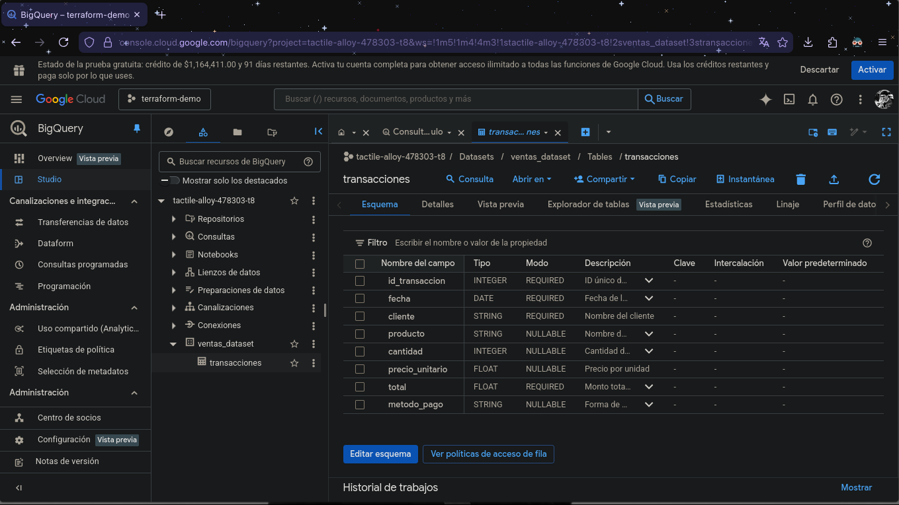

# 🚀 Terraform BigQuery Infrastructure

[](https://www.terraform.io/)
[](https://cloud.google.com/bigquery)
[](LICENSE)

Infrastructure as Code (IaC) project for automating the creation and management of Google Cloud BigQuery datasets and tables using Terraform.



## 📋 Table of Contents

- [Overview](#overview)
- [Architecture](#architecture)
- [Prerequisites](#prerequisites)
- [Project Structure](#project-structure)
- [Installation](#installation)
- [Configuration](#configuration)
- [Usage](#usage)
- [Resources Created](#resources-created)
- [Outputs](#outputs)
- [Security](#security)
- [Troubleshooting](#troubleshooting)
- [Contributing](#contributing)
- [License](#license)

## 🎯 Overview

This project automates the provisioning of BigQuery infrastructure on Google Cloud Platform using Terraform. It creates:

- A BigQuery dataset for storing sales data
- A structured table with a predefined schema for transaction records
- Proper labels and metadata for resource organization

### Key Features

✅ **Infrastructure as Code**: Version-controlled, reproducible infrastructure  
✅ **Automated Provisioning**: Single-command deployment  
✅ **Best Practices**: Follows Google Cloud and Terraform conventions  
✅ **Easy Maintenance**: Simple updates and modifications  
✅ **Documentation**: Comprehensive inline comments and guides

## 🏗️ Architecture

```
Google Cloud Platform
└── Project: tactile-alloy-478303-t8
    └── BigQuery
        └── Dataset: ventas_dataset (US region)
            └── Table: transacciones
                ├── id_transaccion (INTEGER, REQUIRED)
                ├── fecha (DATE, REQUIRED)
                ├── cliente (STRING, REQUIRED)
                ├── producto (STRING, NULLABLE)
                ├── cantidad (INTEGER, NULLABLE)
                ├── precio_unitario (FLOAT, NULLABLE)
                ├── total (FLOAT, REQUIRED)
                └── metodo_pago (STRING, NULLABLE)
```

## 📦 Prerequisites

Before you begin, ensure you have the following installed and configured:

### Required Software

- **Terraform** >= 1.0
  ```bash
  # Verify installation
  terraform version
  ```

- **Google Cloud SDK** (gcloud CLI)
  ```bash
  # Verify installation
  gcloud --version
  ```

- **Git** (for version control)
  ```bash
  git --version
  ```

### Google Cloud Requirements

- Active GCP account
- GCP project with billing enabled
- Service account with appropriate permissions:
  - `BigQuery Admin` role
  - `Service Account User` role

## 📂 Project Structure

```
terraform-bigquery/
├── docs/
│   └── preview.png           # Architecture diagram or preview
├── keys/
│   └── gcp-key.json         # GCP service account credentials (GITIGNORED)
├── LICENSE                   # Project license
├── main.tf                   # Main Terraform resources
├── outputs.tf               # Output definitions
├── provider.tf              # Provider configuration
├── terraform.tfstate        # Terraform state file (GITIGNORED)
└── terraform.tfstate.backup # State backup (GITIGNORED)
```

### File Descriptions

| File                | Purpose                                                     |
| ------------------- | ----------------------------------------------------------- |
| `provider.tf`       | Configures the Google Cloud provider and Terraform settings |
| `main.tf`           | Defines BigQuery dataset and table resources                |
| `outputs.tf`        | Specifies output values displayed after deployment          |
| `keys/gcp-key.json` | Service account credentials (never commit to Git)           |
| `terraform.tfstate` | Tracks current infrastructure state                         |

## 🚀 Installation

### Step 1: Clone the Repository

```bash
git clone https://github.com/yourusername/terraform-bigquery.git
cd terraform-bigquery
```

### Step 2: Set Up GCP Credentials

1. **Create a Service Account** in Google Cloud Console:
   - Navigate to **IAM & Admin** > **Service Accounts**
   - Click **Create Service Account**
   - Name: `terraform-bigquery`
   - Grant roles: `BigQuery Admin`

2. **Generate JSON Key**:
   - Select your service account
   - Go to **Keys** tab
   - Click **Add Key** > **Create New Key**
   - Choose **JSON** format
   - Save the downloaded file

3. **Place the Key File**:
   ```bash
   # Create keys directory if it doesn't exist
   mkdir -p keys
   
   # Move your downloaded key (rename appropriately)
   mv ~/Downloads/your-key-file.json keys/gcp-key.json
   
   # Secure the file (Linux/Mac)
   chmod 600 keys/gcp-key.json
   ```

### Step 3: Configure Project ID

Edit `provider.tf` and update the project ID:

```hcl
provider "google" {
  credentials = file("keys/gcp-key.json")
  project     = "your-gcp-project-id"  # ⚠️ CHANGE THIS
  region      = "us-central1"
}
```

## ⚙️ Configuration

### Enable Required APIs

```bash
# Authenticate with gcloud
gcloud auth login

# Set your project
gcloud config set project YOUR_PROJECT_ID

# Enable BigQuery API
gcloud services enable bigquery.googleapis.com
```

### Customize Resources (Optional)

You can modify the following in `main.tf`:

- **Dataset ID**: Change `dataset_id` value
- **Table ID**: Change `table_id` value
- **Location**: Change `location` (e.g., `"EU"`, `"US"`)
- **Schema**: Add or remove columns in the schema definition
- **Labels**: Update labels for better organization

## 🎮 Usage

### Initialize Terraform

Download required providers and initialize the working directory:

```bash
terraform init
```

**Expected output:**
```
Initializing the backend...
Initializing provider plugins...
- Finding hashicorp/google versions matching "~> 5.0"...
- Installing hashicorp/google v5.45.2...

Terraform has been successfully initialized!
```

### Validate Configuration

Check for syntax errors:

```bash
terraform validate
```

**Expected output:**
```
Success! The configuration is valid.
```

### Preview Changes

See what Terraform will create:

```bash
terraform plan
```

This command shows a detailed execution plan without making any changes.

### Apply Configuration

Create the infrastructure:

```bash
terraform apply
```

1. Review the planned changes
2. Type `yes` when prompted
3. Wait for completion

**Expected output:**
```
Apply complete! Resources: 2 added, 0 changed, 0 destroyed.

Outputs:

dataset_id = "ventas_dataset"
ruta_completa = "tactile-alloy-478303-t8.ventas_dataset.transacciones"
tabla_id = "transacciones"
```

### Destroy Infrastructure

To remove all created resources:

```bash
terraform destroy
```

⚠️ **Warning**: This action is irreversible and will delete all data.

## 🏗️ Resources Created

### BigQuery Dataset

| Property          | Value                                                  |
| ----------------- | ------------------------------------------------------ |
| **Dataset ID**    | `ventas_dataset`                                       |
| **Friendly Name** | Dataset de Ventas                                      |
| **Location**      | US (multi-region)                                      |
| **Description**   | Dataset created with Terraform for managing sales data |
| **Labels**        | `ambiente: desarrollo`, `equipo: analytics`            |

### BigQuery Table: `transacciones`

Complete schema for transaction records:

| Column            | Type    | Mode     | Description                   |
| ----------------- | ------- | -------- | ----------------------------- |
| `id_transaccion`  | INTEGER | REQUIRED | Unique transaction identifier |
| `fecha`           | DATE    | REQUIRED | Transaction date              |
| `cliente`         | STRING  | REQUIRED | Customer name                 |
| `producto`        | STRING  | NULLABLE | Product name                  |
| `cantidad`        | INTEGER | NULLABLE | Product quantity              |
| `precio_unitario` | FLOAT   | NULLABLE | Unit price                    |
| `total`           | FLOAT   | REQUIRED | Total transaction amount      |
| `metodo_pago`     | STRING  | NULLABLE | Payment method                |

### Example Data Insert

```sql
INSERT INTO `tactile-alloy-478303-t8.ventas_dataset.transacciones` 
(id_transaccion, fecha, cliente, producto, cantidad, precio_unitario, total, metodo_pago)
VALUES 
(1, '2024-11-14', 'John Doe', 'Laptop', 1, 1200.00, 1200.00, 'credit_card'),
(2, '2024-11-14', 'Jane Smith', 'Mouse', 2, 25.00, 50.00, 'cash');
```

### Example Query

```sql
SELECT 
  cliente,
  SUM(total) as total_sales,
  COUNT(*) as num_transactions
FROM `tactile-alloy-478303-t8.ventas_dataset.transacciones`
GROUP BY cliente
ORDER BY total_sales DESC;
```

## 📤 Outputs

After successful deployment, Terraform provides the following outputs:

```hcl
dataset_id          # BigQuery dataset ID
tabla_id            # BigQuery table ID
ruta_completa       # Full path for SQL queries (project.dataset.table)
```

### Using Outputs

```bash
# Display all outputs
terraform output

# Display specific output
terraform output ruta_completa

# Export to environment variable
export TABLE_PATH=$(terraform output -raw ruta_completa)
```

## 🔒 Security

### Critical Security Practices

⚠️ **NEVER commit sensitive files to Git:**

```gitignore
# .gitignore
keys/*.json
*.tfstate
*.tfstate.backup
.terraform/
terraform.tfvars
```

### Protect Your Credentials

```bash
# Set restrictive permissions on credentials
chmod 600 keys/gcp-key.json

# Verify .gitignore is working
git status  # Should NOT show keys/gcp-key.json
```

### Service Account Best Practices

✅ **DO:**
- Use dedicated service accounts per project
- Apply principle of least privilege
- Rotate keys regularly
- Enable audit logging

❌ **DON'T:**
- Share service account keys
- Commit keys to version control
- Use overly permissive roles
- Reuse keys across projects

## 🔧 Troubleshooting

### Common Issues

#### Issue: "Error 400: Invalid resource name"

**Cause**: Incorrect project ID in `provider.tf`

**Solution**:
```bash
# List your projects
gcloud projects list

# Update provider.tf with correct PROJECT_ID
```

#### Issue: "API not enabled"

**Cause**: BigQuery API is not enabled for your project

**Solution**:
```bash
gcloud services enable bigquery.googleapis.com
```

#### Issue: "Permission denied"

**Cause**: Service account lacks necessary permissions

**Solution**:
1. Go to GCP Console → IAM & Admin → IAM
2. Find your service account
3. Add `BigQuery Admin` role

#### Issue: "terraform init" hangs

**Cause**: Network connectivity issues or proxy settings

**Solution**:
```bash
# Try with verbose output
terraform init -upgrade

# Check internet connection
ping google.com
```

### Getting Help

```bash
# Show detailed error logs
terraform apply -verbose

# Show current state
terraform show

# List all resources
terraform state list

# Validate configuration
terraform validate
```

## 🤝 Contributing

Contributions are welcome! Please follow these steps:

1. **Fork** the repository
2. **Create** a feature branch (`git checkout -b feature/AmazingFeature`)
3. **Commit** your changes (`git commit -m 'Add some AmazingFeature'`)
4. **Push** to the branch (`git push origin feature/AmazingFeature`)
5. **Open** a Pull Request

### Code Standards

- Follow Terraform best practices
- Add comments for complex logic
- Update documentation for new features
- Test changes before submitting PR

## 📚 Additional Resources

- [Terraform Documentation](https://www.terraform.io/docs)
- [Google Cloud BigQuery Docs](https://cloud.google.com/bigquery/docs)
- [Terraform Google Provider](https://registry.terraform.io/providers/hashicorp/google/latest/docs)
- [BigQuery Best Practices](https://cloud.google.com/bigquery/docs/best-practices)

## 📄 License

This project is licensed under the MIT License - see the [LICENSE](LICENSE) file for details.

## ✍️ Author

**Jacob Oblandon**
- GitHub: [@jacoboblandon](https://github.com/jacoboblandon)
- Email: jacoboblandon94@gmail.com

## 🙏 Acknowledgments

- Thanks to the Terraform community for excellent documentation
- Google Cloud Platform for providing robust infrastructure services
- HashiCorp for creating Terraform

---

## 📊 Project Status

✅ **Status**: Active and maintained  
🔄 **Last Updated**: November 2024  
📌 **Version**: 1.0.0

---

**Made with ❤️ using Terraform and Google Cloud Platform**